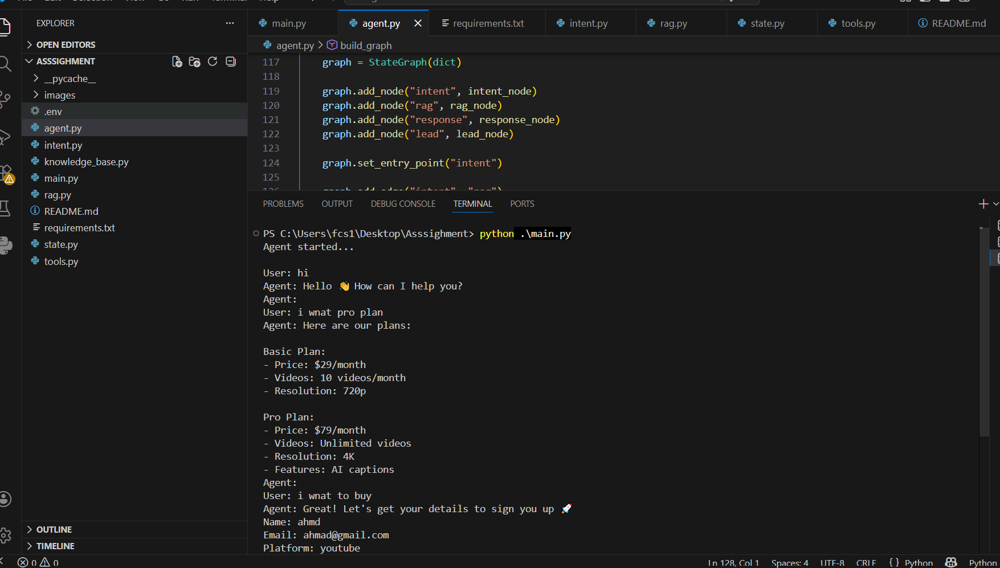
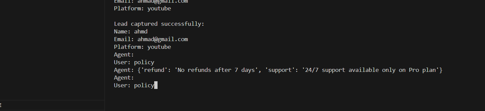

# Social-to-Lead Agent – AutoStream AI Agent
## Overview

This project is an AI-powered conversational agent built for a fictional SaaS company AutoStream, as part of the ServiceHive Inflx assignment.

The system simulates a real-world Social-to-Lead AI workflow, where user conversations are analyzed, understood, and converted into structured business actions such as lead qualification and capture.

The agent is designed using a lightweight combination of:

-Rule-based Intent Detection
-RAG (Retrieval-Augmented Generation)
-State Machine (LangGraph-inspired workflow)

It avoids heavy external LLM dependencies and focuses on logic, structure, and real-world agent desi
# Features
1.  Intent Detection

The agent classifies user input into 3 categories:

greeting → casual messages like "hi"
question → pricing or product inquiries
high_intent → users ready to buy or sign up

2.  RAG (Knowledge Retrieval)

The agent retrieves structured information from a local knowledge base.

## AutoStream Pricing:

Basic Plan

$29/month
10 videos/month
720p resolution

Pro Plan

$79/month
Unlimited videos
4K resolution
AI captions
📄 Policies:
No refunds after 7 days
24/7 support available only on Pro

3.  Lead Capture Tool (Mock API)

When a user shows high buying intent, the agent collects:

Name
Email
Platform (YouTube, Instagram, etc.)

Then triggers a mock backend function:
```pyhton
def mock_lead_capture(name, email, platform):
    print(f"Lead captured successfully: {name}, {email}, {platform}")
```
# Architecture

The system is built using a state-based pipeline inspired by LangGraph:
User Input
    ↓
Intent Detection Node
    ↓
RAG Retrieval Node
    ↓
Response Node
    ↓
Conditional Routing
    ↓
Lead Capture Node (if high intent)


# State Management

The agent maintains a conversation state across multiple turns:
```pyhton
state = {
    "user_input": "",
    "intent": "",
    "retrieved_info": "",
    "step": "",
    "name": "",
    "email": "",
    "platform": ""
}
```
This allows the agent to:

-Remember user intent
-Track conversation progress
-Handle multi-step lead collection

# Project Structure
```bash
project/
│
├── main.py            
├── agent.py           # Graph builder & workflow logic
├── intent.py          # Intent classification logic
├── rag.py             # Knowledge retrieval system
├── tools.py           
├── state.py           
├── knowledge.json     # RAG knowledge base
├── requirements.txt   
└── README.md
```

# How to Run
1. Install dependencies
```bash
pip install -r requirements.txt
```
2. Run the agent:
```bash
python main.py
```
# Result
## Demo Video Link: https://drive.google.com/file/d/1NhL7vyHUtkq6s0XpKGf-25LwAmWE_oKI/view?usp=vids_web




# Future Improvements
-Add real LLM (GPT-4o / Gemini)
-Replace RAG with vector database (FAISS/Chroma)
-Improve intent classifier using transformer model
-Deploy as REST API / WhatsApp bot

# Author
Nisar Ahmad Zamani
Machine Learning Engineer | AI Engineer
```bash
GitHub: https://github.com/NisarAhmad7
LinkedIn: https://www.linkedin.com/in/nisar-ahmad-zamani-7b10b63a9
```


